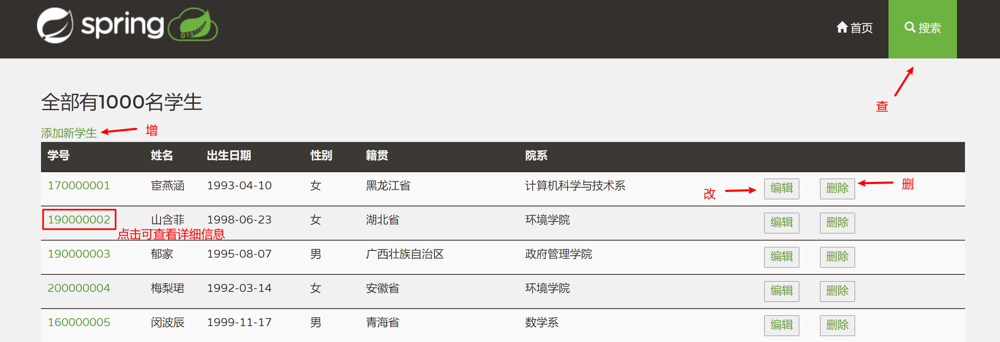
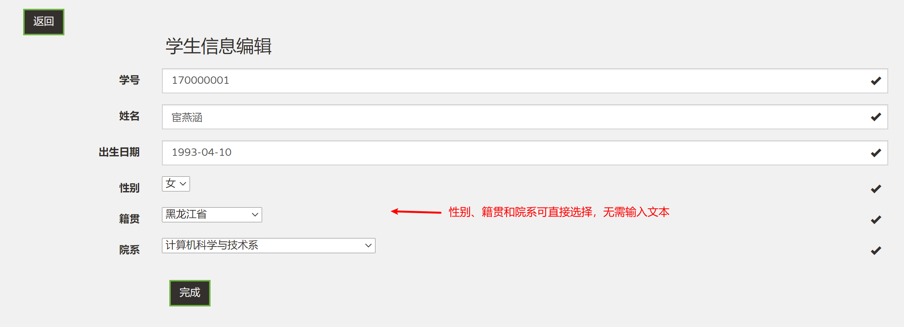
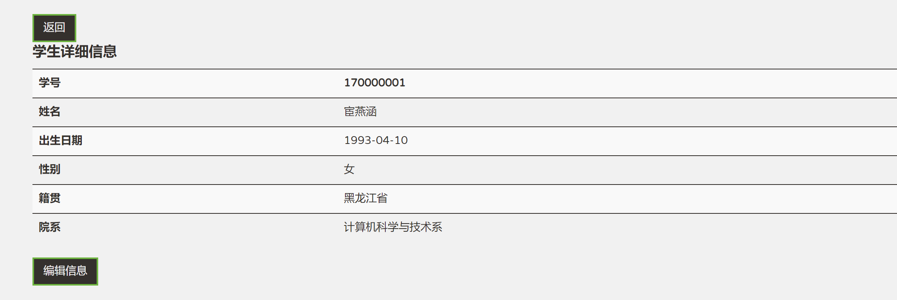
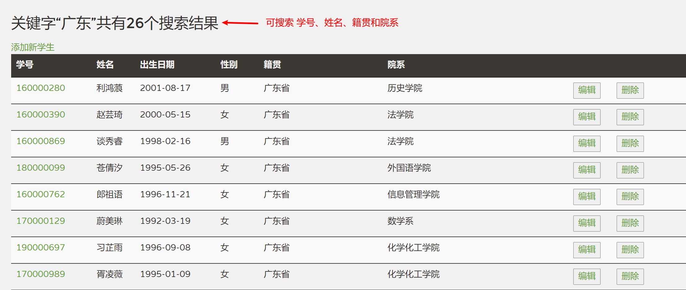
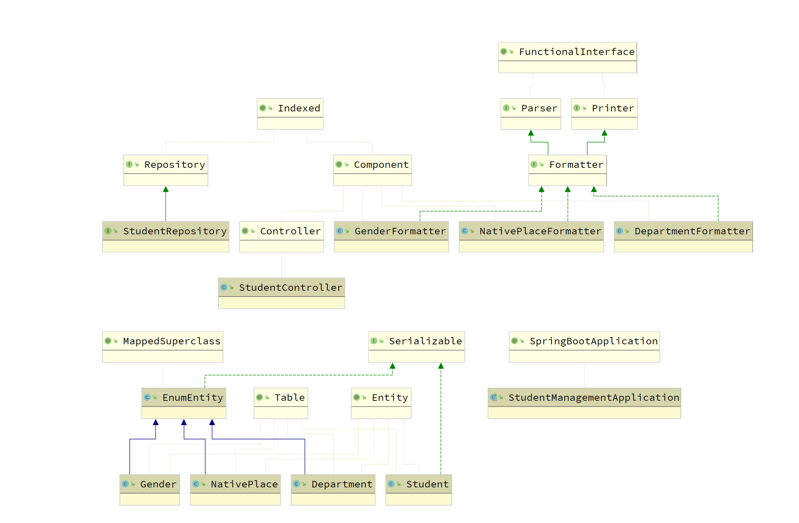

本项目是《[软件体系结构](https://github.com/njuics/sa-2021)》课程的作业，使用spring-boot实现一个学生信息管理系统。

### 使用

请先安装maven，然后在文件根目录中运行

```
mvn spring-boot:run
```

即可启动，默认会运行在本地的`8080`端口。

### 用户界面说明

为了方便演示，系统中默认带有随机生成的1000位学生的数据。









### 开发说明

后端的核心代码位于`com.chenjinchi.studentmanagement`包中，包含`controller`、`model`和`repository`三个部分。HTML模板是在[spring-petclinic](https://github.com/spring-projects/spring-petclinic) 的基础上修改而来。



### 参考资料

1. [spring-petclinic](https://github.com/spring-projects/spring-petclinic)

2. https://njuics.github.io/sa-2021/04-mvc.html
3. https://www.bilibili.com/video/BV1ME411x7SH?t=762&p=6


-------------------
https://www.petrikainulainen.net/programming/spring-framework/spring-batch-tutorial-reading-information-from-an-excel-file/