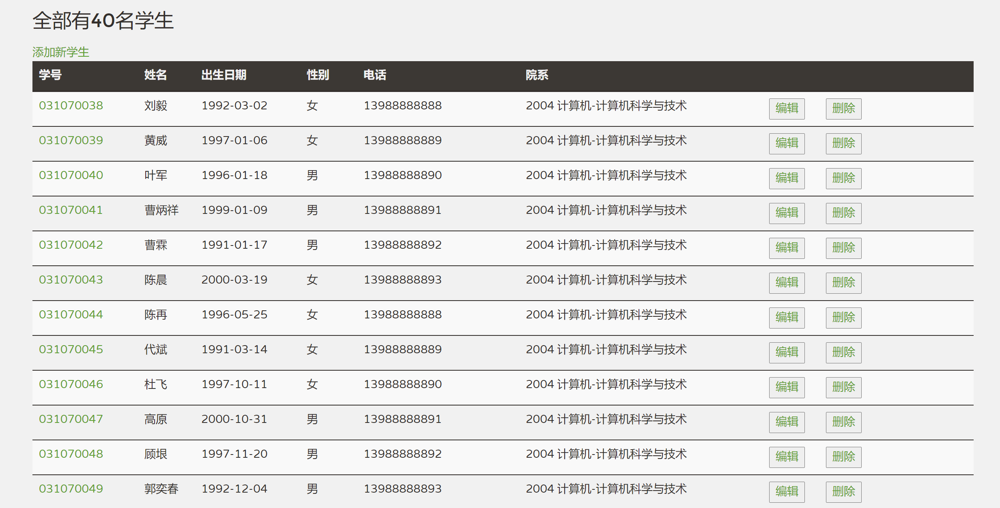

本项目是《[软件体系结构](https://github.com/njuics/sa-2021)》课程的作业，使用spring-boot实现一个学生信息管理系统。该分支加入使用Spring Batch从Excel文件中读取学生信息的功能，新增代码主要在`com.chenjinchi.studentmanagement.batch`包中。

### 流程

#### reader

reader部分使用[spring-batch-excel](https://github.com/spring-projects/spring-batch-extensions/tree/master/spring-batch-excel)库完成读取Excel文件、跳过表头和列映射等操作。

```java
@Bean
public PoiItemReader<Student> reader() {
	PoiItemReader<Student> reader = new PoiItemReader<>();
	reader.setName("studentItemReader");
	reader.setResource(new FileSystemResource("src/main/resources/测试数据.xlsx"));
	reader.setLinesToSkip(1);
	reader.setRowMapper(new StudentExcelRowMapper());
	return reader;
}
```

#### processor

processor保留从文件中读取的学号、姓名、电话和院系信息，并随机生成文件中缺失的性别和出生日期进行填充。

#### writer

writer直接将读取到的信息插入数据库。

### 结果



### 参考资料

1. https://www.petrikainulainen.net/programming/spring-framework/spring-batch-tutorial-reading-information-from-an-excel-file/
